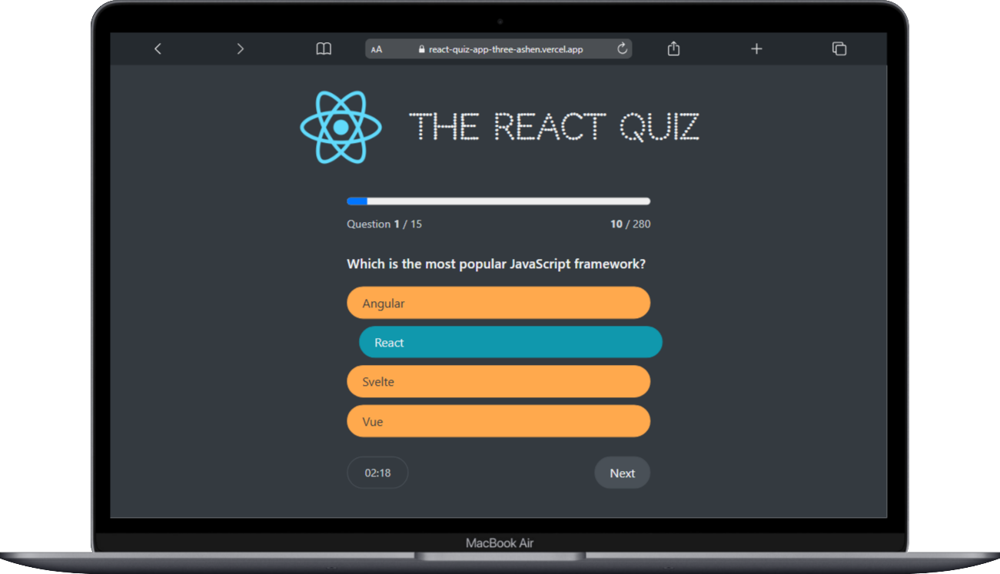

# React Quiz App

A simple and interactive **React Quiz App** designed to test your knowledge of React.js. This app presents a series of React-related questions, tracks the user's progress, calculates scores, and saves the high score. It also features a countdown timer for each question.

## 🚀 Features

- 📝 Multiple-choice React questions.
- ⏳ Timer-based answering system.
- 📊 Score tracking and high score saving.
- 🔄 State management using **useState, useEffect, and useReducer**.
- 📡 Uses **JSON Server** as a backend to fetch quiz questions.

## 📸 Screenshots

### 🔹 MacBook Website View

<p align="center">
  
</p>

<p align="center"><i>MacBook Website View</i></p>

## 🔗 Live Demo

👉 **[Try React Quiz Now](https://react-quiz-app-three-ashen.vercel.app/)**

## 🛠 Technologies Used

- React.js
- JSON Server
- useState, useEffect, useReducer
- LocalStorage for high score persistence

## 📦 Installation & Setup

1. **Clone the repository:**

   ```sh
   git clone https://github.com/mehdiali-mk/react-quiz-app
   cd react-quiz-app
   ```

2. **Install dependencies:**

   ```sh
   npm install
   ```

3. **Start the JSON Server:**

   ```sh
   npx json-server --watch ./Data/Questions.json --port 8088
   ```

4. **Run the app:**
   ```sh
   npm run dev
   ```

## 📄 Folder Structure

```
react-quiz-app/
│-- public/
│-- src/
│   │-- components/
│   │-- assets/
│   │-- App.js
│   │-- index.js
│-- db.json (JSON Server Database)
│-- package.json
│-- README.md
```

## 🤝 Contributing

Contributions are welcome! Feel free to fork this repository, make changes, and submit a pull request.

## 📝 License

This project is open-source and available under the [MIT License](LICENSE).

---

✨ Developed by [Mehdiali Kadiwala](https://github.com/mehdiali-mk/) ✨
